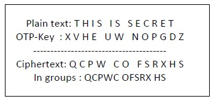

# Encipher



## Introduction

The program generates a one time pad, or in other cases, takes in a given one time pad, and uses it to encrypt and decrypt a given message.

## Table of contents

1. [Description](#description)
2. [Getting Started](#getting-started)
    - [Dependancies](#dependencies)
    - [Installing](#installing)
3. [Executing Program](#executing-program)
    - [Running the program in an IDE](#running-the-program-in-an-ide)
    - [Running the program from the command line](#running-the-program-from-the-command-line)
5. [Test and Edge Cases](#tests-and-edge-cases)
4. [Help](#help)
5. [Authors](#authors)
6. [Acknowledgements](#acknowledgments)

## Description

The one time pad encipher program is meant to provide a more secure and sophisticated form of message encryption as opposed to the Ceasar cipher. Because the Ceasar cipher only uses one shift for all the characters in a message, it provides a loophole that one can just try all the possible 26 combinations and end up cracking the encryption. Therefore it is not as secure. The one time pad encryption closes this caveat. It works by generating a random string of upper case letters that change each time it is ran. These letters will act as the shifts for the message to be encrypted. Because this pad is randomly generated only once, there is no way one can guess or try combinations so it is unbreakable. Making it even more secure is the use of the `secrets` library that is mainly used in cryptocurrency to generate the pad. Users can also intereact with the program through the command line. It provides instructions and commands on how to use the program in the terminal. The program is still under development and collaboraters are welcome.

## Getting Started

### Dependencies

This program was created using Python 3 and runs on that version. The libraries needed are `secrets`, `string` and `sys` for navigating the command line.

### Installing

Users can download the folder of files on [github](https://github.com/amutaya/csc151-a4-repo) and clone the repository. Once downloaded, you can run the `cipher.py` file in any IDE or using the command line. The folder comes with the required files for running the program. Users are free to provide their own messages for encryption and decryption provided they use the generated pad or input their own pad.

## Executing Program

### Running the program in an IDE

* Ensure that you have downloaded `cipher.py`, `pad.txt`, `encrypted-message.txt`.
* Copy and paste the `cipher.py` file into your IDE of choice.
* Click the run button. This decrypts the message in `encrypted-message.txt` using the `pad.txt` provided.
* To generate a pad of random letters, call `generatePad()` with the number of letters as the argument. This will be saved in a file called `pad.txt`. For example, to generate a pad of 100 random letters, you would write:

```
generatePad(100)
```

* To input your own message and pad for encryption, replace:

```
encipher("message-to-encrypt.txt","pad-of-choice.txt")
```

* with your files of choice. You can also use the randomly generated pad from `generatePad()` by passing `pad.txt` in place of the pad of choice. The encrypted message will be saved in a file called `encrypted-message.txt`. This is the file you will pass into `decipher()` if you want to decrypt the message.

* To decrypt a message, use:

```
decipher("message-to-decrypt.txt", "pad-of-choice.txt")
```

* The input pad for decryption must be the same pad used for encryption. Again, you may use the randomly generated pad if you wish.

* N.B: Both `encipher()` and `decipher()` only take in files as input. They do not take a string.

### Running the program from the command line

The `cipher.py` program can also be ran from the command line.

* Again, ensure that you have downloaded all the relevant files.

* Navigate to the same directory as your files. You can use `pwd` to see your current working directory, and `cd directory-name` to change into the directory containing your code files.

* Run the file from the command line by typing `python3 cipher.py`. This should print out the manual on how to use the program. Follow the manual commands to generate a random pad, encrypt and decrypt a message.

## Tests and edge cases

A file called `test_cipher.py` is included in the repository. The file tests for the functionality of the 2 functions included in the program. The first function `test_encryption_decryption()` compares the original message that was passed into `encipher()` for encryption with the output of `decipher()` of that message and the given pad. This ensures that a message encrypted by one file can be decrypted by the other. The other test is for when a user inputs a string instead of a file into the two functions. This should throw an error and prompt the user to enter a valid file name. And finally, the last test compares the output of the decrypted file in upper case to the original message. The two should be identical since the decryption function takes care of upper and lower case letters.

## Help

* A common bug in this code is the confusion of the file names when passing them as arguments. When one runs the code at first, it decrypts the provided message from `encrypted-message.txt` and saves that as `decrypted-message.txt`. Users might then run the program again with a different file to decrypt and forget to change the user input in `decipher()` as it's also `encrypted-message`, but from the previously encrypted text. This can get a little confusing, so users must be careful about file names and what they pass into the functions.
*Users can learn more about the mathematics of the one time pad encryption [here](https://www.youtube.com/watch?v=2_w9l9visH8)

* Users can always refer to the command line manual using:

```
python3 cipher.py -m
```

## Authors

Program was created by Annah N Mutaya 
[@amutaya](https://github.com/amutaya)

## Acknowledgments

* [One time pad source code inspiration](hhttps://github.com/Descent098/simple-otp/blob/master/python/otp.py)
* [Markdown template](https://gist.github.com/DomPizzie/7a5ff55ffa9081f2de27c315f5018afc)
* [Unit testing](https://docs.python.org/3/library/unittest.html)
* [Unit testing - Geeks for Geeks](hhttps://www.geeksforgeeks.org/unit-testing-python-unittest/)